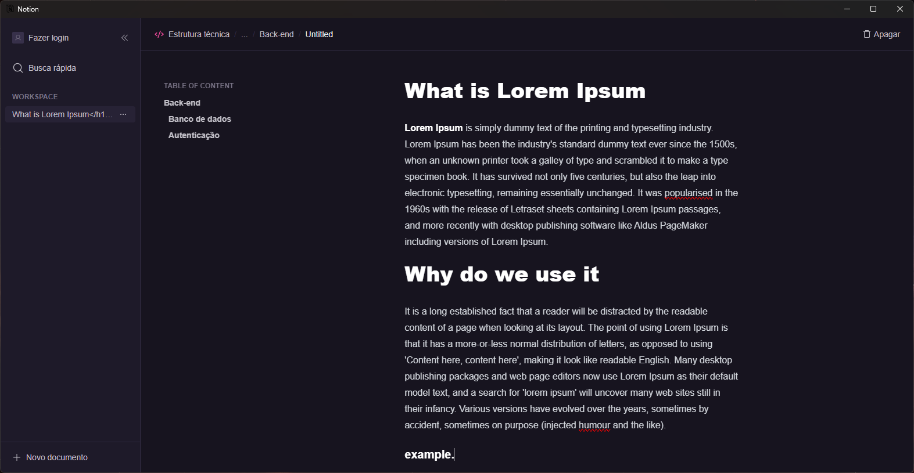

<h1 align="center">
  
</h1>

  
  

 

This project is a simplified version of a note-taking application inspired by Notion, designed for educational purposes. It allows users to create, edit, and organize notes efficiently, providing a minimalistic interface to enhance focus and productivity.

 

  

## 📁 Releases

### [click here](https://github.com/jhonbergmann/electron-desktop-notion/releases)

## 📦 Tech Stack

- Electron

[check in package.json](/package.json)

## 🔩 Installation

To install and run the project locally, follow these steps:

1. Install [**Yarn**](https://yarnpkg.com/) on your computer
1. Clone the repository `git clone https://github.com/jhonbergmann/electron-desktop-notion.git`
1. Navigate to the project directory: `cd electron-desktop-notion`
1. Install the dependencies: `yarn install`

## ⚙️ Usage

1. Start the development server: `yarn dev`

## 📝 License

[MIT © Jhonatan Bergmann](https://github.com/jhonbergmann/electron-desktop-notion/blob/main/LICENSE)
